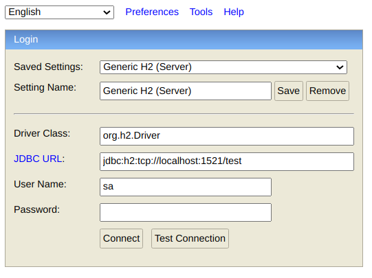

## FileIngest
Spring Batch application to parse a file, and populate the data into a database. 

This application will be containerised using Jib and deployed on Kubernetes as a CronJob

### Technology
This project is to experiment with
- Kotlin
- jOOQ 
    - MyBatis implementation included, which is to replace jOOQ in actual deployment
- GitLab CI/CD

### Try it out

1. For jOOQ to work, it has to generate Java class files based on your database schema
    1. To do so, your database has to be setup, h2 will be used here 
    `$ docker-compose -f h2-compose.yml up`
    1. Go to `localhost:81`, and Connect with the following inputs
    
    
    1. Run the contents of the [schema.sql](src/main/resources/schema.sql) file to populate the database

1. Run the gradle task `generateH2JooqSchemaSource`, to generate the class files. They will be generated in `build/generated-src`
1. Run the gradle task `bootRun` to run the Spring Batch application 

> Note: We have to start up a h2 instance in Step 1 to generate the class files because the embedded H2 in Spring is only started when you run the application (jOOQ needs the files before that)  